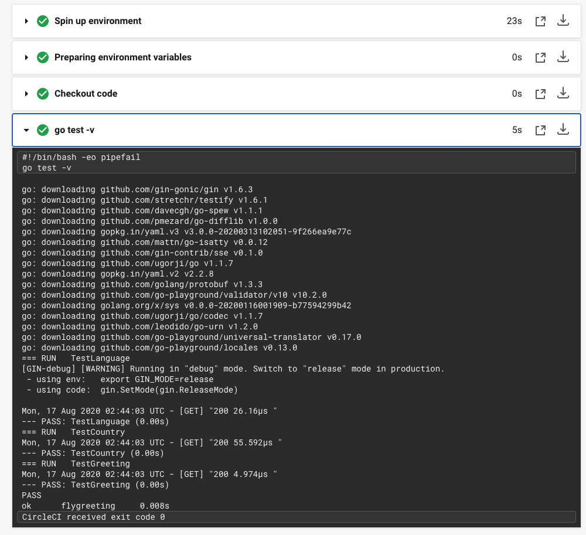
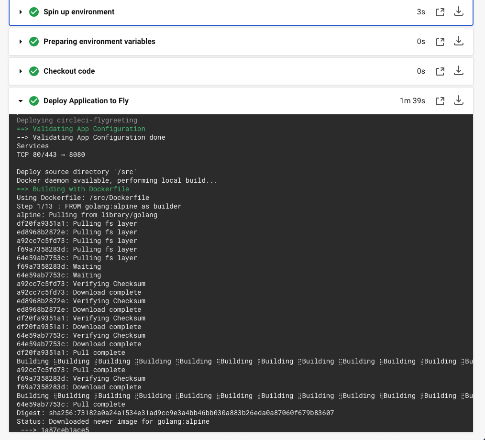

# Continuous Deployment for Fly Applications with CircleCI

[Continuous deployment](https://www.scaledagileframework.com/continuous-deployment/) is a software process that aims to minimize the time it takes between adding changes to an application and deployment to users. To achieve this, every step of the testing, building, and deployment process must be automated. This results in a more consistent release process with fewer errors than manual deployments.

[CircleCI](https://circleci.com/) is one of the most popular continuous integration platforms for automating continuous deployment. It will run your application’s tests and deploy it automatically when you push changes to version control.

[Fly](https://fly.io/) is a Docker-based platform as a service (PaaS) that allows you to deploy applications on the servers closest to your users. This enables you to deliver your application to users with minimal latency and improved reliability. Most applications that can be packaged as a Docker image can be deployed to Fly.

This tutorial describes how to deploy an application to Fly using CircleCI. You will learn how to connect your project's repository to CircleCI and configure it to automate deployments to Fly.

### Prerequisites
- A [Github](http://github.com/) or [Bitbucket](http://bitbucket.org/) account.
- The [Flyctl command line tool](https://fly.io/docs/flyctl/installing/).
- (Optional) [Docker](https://www.docker.com/) for testing the demo application locally.

### Cloning the sample application
This tutorial uses the [flygreeting](https://github.com/fly-examples/flygreeting) sample application. If you use Github, simply fork [the `flygreeting` repository](https://github.com/fly-examples/flygreeting) to your account and clone it to your local machine.

If you use Bitbucket, click the **Create Repository** button, click the **import repository** link at the top right corner, and enter `https://github.com/fly-examples/flygreeting.git` in the URL box, select a project and click the **Import Repository** button. You can then clone the repository to your local machine.

```
git clone git@github.com:fly-examples/flygreeting.git

cd flygreeting
```

It's always a good idea to make sure that your application works locally before deployment. You can test the sample application using Docker:

 ```
docker build -t flygreeting .

docker run -p 8000:8080 -d flygreeting
```

Test that the application is running using `curl`:

```
curl http://localhost:8000/v1/countries/
```

You should get a JSON response with a list of country codes.

```
{"countries":["AD","AE","AF","AG","AI","AL","AM","AO","AQ","AR","AS","AT","AU","AW","AX","AZ","BA","BB","BD","BE","BF","BG","BH","BI","BJ","BL","BM","BN","BO","BQ","BR","BS","BT","BV","BW","BY","BZ","CA","CC","CD","CF","CG","CH","CI","CK","CL","CM","CN","CO","CR","CU","CV","CW","CX","CY","CZ","DE","DJ","DK","DM","DO","DZ","EC","EE","EG","EH","ER","ES","ET","FI","FJ","FK","FM","FO","FR","GA","GB","GD","GE","GF","GG","GH","GI","GL","GM","GN","GP","GQ","GR","GS","GT","GU","GW","GY","HK","HM","HN","HR","HT","HU","ID","IE","IL","IM","IN","IO","IQ","IR","IS","IT","JE","JM","JO","JP","KE","KG","KH","KI","KM","KN","KP","KR","KW","KY","KZ","LA","LB","LC","LI","LK","LR","LS","LT","LU","LV","LY","MA","MC","MD","ME","MF","MG","MH","MK","ML","MM","MN","MO","MP","MQ","MR","MS","MT","MU","MV","MW","MX","MY","MZ","NA","NC","NE","NF","NG","NI","NL","NO","NP","NR","NU","NZ","OM","PA","PE","PF","PG","PH","PK","PL","PM","PN","PR","PS","PT","PW","PY","QA","RE","RO","RS","RU","RW","SA","SB","SC","SD","SE","SG","SH","SI","SJ","SK","SL","SM","SN","SO","SR","SS","ST","SV","SX","SY","SZ","TC","TD","TF","TG","TH","TJ","TK","TL","TM","TN","TO","TR","TT","TV","TW","TZ","UA","UG","UM","US","UY","UZ","VA","VC","VE","VG","VI","VN","VU","WF","WS","YE","YT","ZA","ZM","ZW"]}
```

### Creating the Fly Configuration file

Next, you need to reserve a namespace on the Fly platform remotely and create a fly configuration file. You need the `flyctl` command-line tool for that. If you haven't already, visit [flyctl](https://fly.io/docs/hands-on/installing/) to learn how to install the fly CLI for your machine.

We then login/sign up to fly:

```
# Sign up
flyctl auth signup

# Sign in
flyctl auth login
```

Every fly application needs a `fly.toml` file to manage deployment. You can find a sample `fly.toml` file in your `flygreeting` project. But because you are creating a new Fly app, you are going to delete the old one and recreate your own. This can be done automatically by using the following command:

```
 rm fly.toml

 flyctl apps create
```

The `flyctl apps create` command creates an interactive session that requests things like the 'App name' and 'Organization name'. You can type a unique App name, or leave it blank if you want a Fly to auto-generate name to avoid namespace collisions. Fly will also reserve the app name on the platform, for when you deploy.

At the end of the session, your `fly.toml` file should look like the following, with a different app name:

```
# fly.toml file generated for circleci-flygreeting on 2020-08-16T20:32:19+01:00

app = "circleci-flygreeting"


[[services]]
  internal_port = 8080
  protocol = "tcp"

  [services.concurrency]
    hard_limit = 25
    soft_limit = 20

  [[services.ports]]
    handlers = ["http"]
    port = "80"

  [[services.ports]]
    handlers = ["tls", "http"]
    port = "443"

  [[services.tcp_checks]]
    interval = 10000
    timeout = 2000

```

### Connecting CircleCI to Github/Bitbucket
To start using CircleCI with your repository, complete the following steps:

1. Visit [circleci.com/signup](https://circleci.com/signup/).
2. Click one of the buttons: **Sign up with Github** or **Sign up with Bitbucket** to start the signup process.
3. Enter your Github or Bitbucket passwords and authorize two-factor Authentication if present.
4. Click the **Authorize Circle CI** or **Grant access** button to grant access. You are immediately redirected to the [Circle CI Project Dashboard](https://app.circleci.com/projects).
5. Select the organization you wish to work with.
6. You will be taken to your organization's dashboard to see a list of all its repositories. The `flygreeting` repository should be listed.

### Authorize CircleCI for deployment
CircleCI needs your authorization to automate deployments on your behalf. Generate a token using flyctl and add it to the `flygreeting` project setting on CircleCI's dashboard.

To generate a fly token, run the following command from your local terminal:

```
flyctl auth token
```

Copy the generated token and go to the [CircleCI project page](https://app.circleci.com/projects). Select the organization and find the `flygreeting` repository. Click the **Set Up Project** button in front of it. Click the **Use Existing Config** button, then click the **Start Building** button. As expected, the build fails with:

`No .circleci/config.yml was found in your project. Click Add Config to choose how to add a config file or refer to documentation.` 

This message indicates that you have not configured the project yet.

At the upper right corner of the page, click the **Project Setting** button with the gear icon. This takes you to the CircleCI `flygreeting` settings page. On the sidebar, select **Environment Variables**. Click the **Add Variable** button. Enter the name as `FLY_API_TOKEN`, paste the previously generated API token into the value box and click **Add Environment Variable** to save. 

By adding the token to the `flygreeting` project’s environmental variables, you are making sure that CircleCI has access to the authentication it needs to deploy `flygreeting` to the Fly platform on your behalf.

### Configuring CircleCI for Deployment

To configure automated deployment with CircleCI, create a new file at `.circleci/config.yml` file.

```
mkdir .circleci && cd .circleci

touch config.yml
```

Add the following code to the `config.yml` file:
```
version: 2
jobs:
  test:
    docker:
        # specify the version
        - image: circleci/golang:1.14
    steps:
        # fetch repo from Github
        - checkout
        # Run tests
        - run: go test -v
  deploy:
    docker:
        # specify OS base to run the steps from
        - image: alpine:3.12
    steps:
        - checkout
        - run: 
            name: Deploy Application to Fly
            command: |
                chmod +x scripts/deploy.sh
                ./scripts/deploy.sh


workflows:
    version: 2
    test-and-deploy:
        jobs:
            - test
            - deploy:
                requires:
                    # the test job must pass, before starting the deploy job 
                    - test
                filters:
                    branches:
                        # deploy only on branch main
                        only: main
```

#### Walk-through of the `config.yml` file
- **version**: In the file, we instruct CircleCI to use [its most recent version](https://circleci.com/docs/2.0/configuration-reference/#version).

- **jobs**: The `jobs` section contains two jobs: `test` and `deploy`. 
  - The `test` job will run tests in the `flygreeting` app using a [golang Docker image](https://hub.docker.com/_/golang).
  - The `deploy` job specifies the Alpine Docker image and two `steps` to checkout our code and create a context with which to work from.

- **run**: The `run` command includes a `name` attribute for easier identification during the build process. The `command` attribute sets the deploy script (which is created in the next step) and runs it.

- **workflows**: The `workflows` section enables us to configure the manner and order in which the jobs should run.

### Writing the Deployment Script
Next, create the deployment script at `scripts/deploy.sh` which was referenced in `config.yml` above:

```
mkdir scripts && cd scripts

touch deploy.sh
```

Open `scripts/deploy.sh` and populate it with the following content:

```
#!/bin/sh -l

# install curl
apk add --no-cache curl

# install flyctl
curl -L https://fly.io/install.sh | sh

# set flyctl environmental variables
export FLYCTL_INSTALL="/root/.fly"

export PATH="$FLYCTL_INSTALL/bin:$PATH"

echo "Successfully Installed Flyctl"

# deploy app
sh -c "flyctl deploy"

# get app Information
sh -c "flyctl info"

exit 0
```

The script installs `curl` and uses it to install the [flyctl command line tool](https://fly.io/docs/flyctl/). Then it sets the environment variables and deploys the application using `flyctl deploy`. The last command, `flyctl info`, displays metadata like the application name, status, and version.

### Testing the Deployment
Now that the application is configured for deployment to CircleCI, and you’ve written the deployment script, it's time to test if it works. The goal is to ensure that committing and pushing the code to the `flygreeting` repository kicks off a build process in CircleCI and ultimately deploys the `flygreeting` app.

Commit and push your changes to the `main` branch of your Github/Bitbucket repository. You can monitor the build process by visiting the CircleCI project Dashboard. Selecting `flygreeting` should take you to the project's build pipelines. Here you'll see the project's workflow, `test-and-deploy`, and its jobs, `test` and `deploy`, building.



You can tell the build is successful once you see a green success label.



To test the application, call the `/countries` endpoint using curl:

```bash
curl http://<your-fly-app-name>.fly.dev/v1/countries/
```

You should see a JSON response with the same country abbreviations seen above. Any code changes you push to your repository will kick off an automated CircleCI deployment workflow.

## Conclusion
This tutorial has demonstrated how to test and deploy a Go application to Fly using CircleCI. You have learned how to use the flyctl command-line tool, connect CircleCI to a version control platform, and configure automated deployments. Setting up continuous deployment across your application is an investment, but once done, it will significantly reduce the complexity of maintaining your app.

Further reading about the concepts discussed in this tutorial can be found here:
- [Flyctl CLI Reference](https://fly.io/docs/flyctl/)
- [CircleCI Configuration Reference](https://circleci.com/docs/2.0/configuration-reference/)
