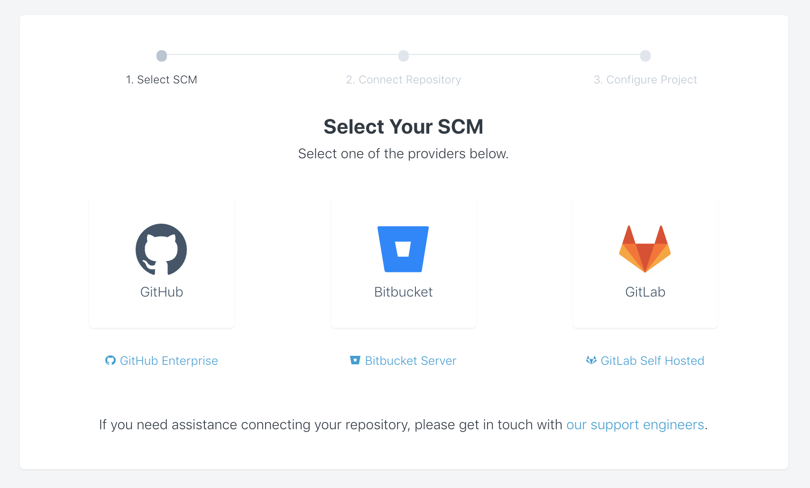
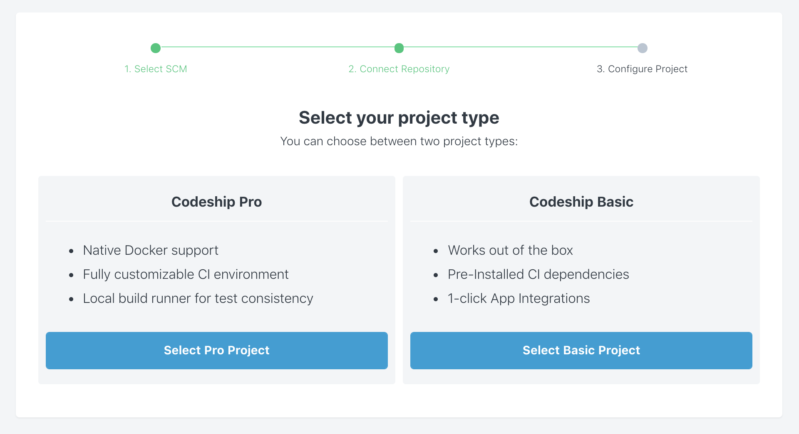
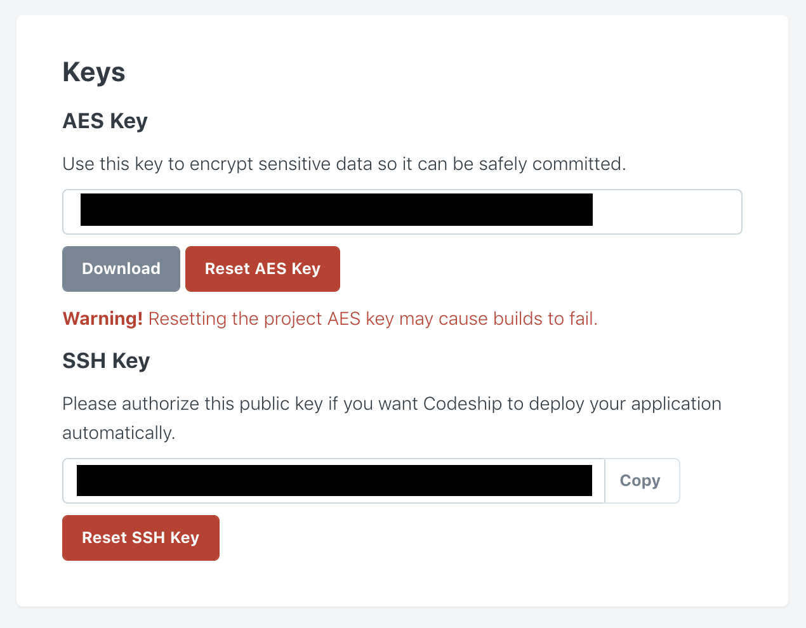
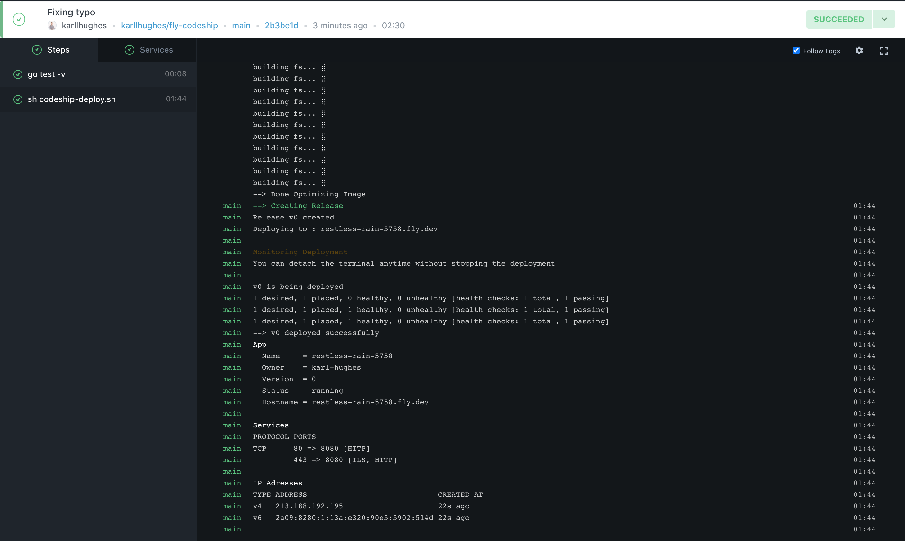

## Continuous Deployment to Fly with Codeship Pro
[Continuous deployment](https://www.scaledagileframework.com/continuous-deployment/), in software development, is an automated process that aims to reduce the time elapsed between code changes to an application, and deployment. To achieve continuous deployment, all of the steps that make it possible for an application to be deployed must be automated, from the moment code is updated in version control.

The principal benefit of this process is that it creates a release process that is repeatable, reliable, and predictable. This reduces the software development cycle time and gets features and bug fixes to users faster.

[Codeship](https://codeship.com/) is a fast and secure hosted continuous integration service that scales with your needs. It supports GitHub, Bitbucket, and GitLab projects. CodeShip uses two types of project structures Basic and Pro. Basic is for running traditional non-containerized applications and Pro for using Docker to define your CI/CD environment and run your build pipeline. Its free plan allows up to 100 builds per month, with unlimited projects and unlimited team members. 

[Fly](https://fly.io/) is a Docker-based platform as a service (PaaS) that allows you to deploy  globally-distributed applications on the edge. Being location-aware, Fly enables you to serve your application from the edge node closest to  your users. Most applications that can be packaged as a Docker image
can be deployed to Fly.

## How to Configure Codeship Pro to Deploy Your Application to Fly

In this tutorial, you’ll learn how to deploy an application to Fly.io using Codeship Pro. You’ll see how to connect your application’s repository, and walk through the steps to configure Codeship to run your tests and deploy your application to Fly.

### Prerequisites
- A [GitHub](https://github.com/), [GitLab](https://about.gitlab.com/) or
 [Bitbucket](https://bitbucket.org/) account.
- The [Flyctl command line tool](https://fly.io/docs/flyctl/installing/).
- A [Codeship](https://codeship.com/) account.
- The [Jet CLI](https://documentation.codeship.com/pro/jet-cli/installation/)
- (Optional) [Docker](https://www.docker.com/) for testing the demo application
 locally.

### Cloning the Flygreeting Demo Application
To demonstrate deploying an application using Codeship, you can use the [Flygreeting sample app on GitHub](https://github.com/fly-examples/flygreeting). [Fork](https://docs.github.com/en/github/getting-started-with-github/fork-a-repo) the [flygreeting](https://github.com/fly-examples/flygreeting) repository, and
then clone it to your local machine:

```bash
git clone git@github.com:<your-username>/flygreeting.git
cd flygreeting
```

To test the Flygreeting app locally, you can run it using Docker:

```bash
docker build -t flygreeting .
docker run -p 8000:8080 -d flygreeting
```

To test the application, call the `/countries` endpoint using curl:

```bash
curl http://localhost:8000/v1/countries/
```

You should see a JSON response with all the available country abbreviations:

```json
{"countries":["AD","AE","AF","AG","AI","AL","AM","AO","AQ","AR","AS","AT","AU","AW","AX","AZ","BA","BB","BD","BE","BF","BG","BH","BI","BJ","BL","BM","BN","BO","BQ","BR","BS","BT","BV","BW","BY","BZ","CA","CC","CD","CF","CG","CH","CI","CK","CL","CM","CN","CO","CR","CU","CV","CW","CX","CY","CZ","DE","DJ","DK","DM","DO","DZ","EC","EE","EG","EH","ER","ES","ET","FI","FJ","FK","FM","FO","FR","GA","GB","GD","GE","GF","GG","GH","GI","GL","GM","GN","GP","GQ","GR","GS","GT","GU","GW","GY","HK","HM","HN","HR","HT","HU","ID","IE","IL","IM","IN","IO","IQ","IR","IS","IT","JE","JM","JO","JP","KE","KG","KH","KI","KM","KN","KP","KR","KW","KY","KZ","LA","LB","LC","LI","LK","LR","LS","LT","LU","LV","LY","MA","MC","MD","ME","MF","MG","MH","MK","ML","MM","MN","MO","MP","MQ","MR","MS","MT","MU","MV","MW","MX","MY","MZ","NA","NC","NE","NF","NG","NI","NL","NO","NP","NR","NU","NZ","OM","PA","PE","PF","PG","PH","PK","PL","PM","PN","PR","PS","PT","PW","PY","QA","RE","RO","RS","RU","RW","SA","SB","SC","SD","SE","SG","SH","SI","SJ","SK","SL","SM","SN","SO","SR","SS","ST","SV","SX","SY","SZ","TC","TD","TF","TG","TH","TJ","TK","TL","TM","TN","TO","TR","TT","TV","TW","TZ","UA","UG","UM","US","UY","UZ","VA","VC","VE","VG","VI","VN","VU","WF","WS","YE","YT","ZA","ZM","ZW"]}
```

### Setting Up Codeship
Now that you have your repository ready and you know the demo application works, you are ready to set up Codeship Pro. After you've logged into your Codeship account, go to the **Projects** tab and click **New Project**.

Select your source control management platform, then select your organization and repository to connect.



Then select Codeship Pro when presented with the option. [Codeship Basic](https://codeship.com/features/basic) is simpler to get started with, but not as powerful as [Codeship Pro](https://codeship.com/features/pro), which you'll use for this tutorial.



From the project dashboard in Codeship, go to the **General** tab. Here you can find your AES key, which you will use to encrypt your Fly authentication token so that Codeship can deploy applications on your behalf. Copy the AES key and save it to a new file at the root directory of your project called `codeship.aes`.



To make sure this key and your environment variables are not checked into version control, add them to your `.gitignore` file:

```gitignore
...
codeship.aes
.env
```

Finally, Codeship Pro uses two configuration files (`codeship-services.yml` and `codeship-steps.yml`) to run the build and deploy steps for your project. Add these two files to the root directory of your project.

#### `codeship-services.yml`

```yaml
main:
  build:
    dockerfile: Dockerfile-test
  encrypted_env_file:
    - env.encrypted
```

#### `codeship-steps.yml`

```yaml
# Run your tests
- service: main
  command: go test -v
# Run the deployment script
- service: main
  command: sh codeship-deploy.sh
```

You will notice that none of the files referenced in these two yaml files exist yet. In the subsequent steps, you'll see how to create each of them and what they do for your test and deployment process.
  
### Creating the Dockerfile and Deployment Script
Codeship Pro uses Docker to run your tests and deployment scripts. As such, you need to give it a Dockerfile to use. Sometimes you can use the same Dockerfile you use for your production build, but usually you'll need a different file as your production Dockerfile might not contain build artifacts or spec files you use for testing.

The Dockerfile currently employed in the Flygreeting app builds the Go app and then sets a different user to run the executable. This means that you can't run your app's test files using this image, so you need a new Dockerfile. Create one called `Dockerfile-test` and add the following:

```dockerfile
FROM golang:alpine
RUN apk add build-base
RUN mkdir /build
ADD . /build/
WORKDIR /build
RUN go build -o main .
CMD ["./main"]
```

This will allow your test step to run, but you also need a deploy script that Codeship will run when your tests are successful. Create a new file called `codeship-deploy.sh` and add the following:

```shell script
#!/bin/sh -l

# Install curl
apk --no-cache add curl

# Use curl to install flyctl
curl -L https://fly.io/install.sh | sh

# Set flyctl install path
export FLYCTL_INSTALL="/root/.fly"
export PATH="$FLYCTL_INSTALL/bin:$PATH"
echo "Successfully Installed Flyctl"

# deploy app
sh -c "flyctl deploy -t $FLYCTL_AUTH_TOKEN"

# get app Information
sh -c "flyctl info -t $FLYCTL_AUTH_TOKEN"

exit 0
```

This shell script installs [curl](https://curl.haxx.se/), uses curl to install the Flyctl command line app, then uses your Fly auth token to deploy your app. In the next step, you'll see how to get this token and securely pass it to Codeship.

### Preparing for Deployments
Before you can deploy this Fly app, you need to remove the existing `fly.toml` configuration and initialize your own Fly app.

If you haven't already signed up for a Fly account, you can sign up from the command-line app or sign in to your existing app:

```bash
# Sign up
flyctl auth signup

# Or sign in
flyctl auth login
```

Next, remove the existing `fly.toml` file and initialize a new app:

```bash
rm fly.toml && flyctl init
```

The command-line will prompt you to name your app, select an organization, select a "builder" (use `Dockerfile`), and enter an internal port. When you finish this session, you'll have a new `fly.toml` file that looks like this:

```toml
# fly.toml file generated for restless-rain-5758 on 2020-09-13T15:37:54-05:00

app = "restless-rain-5758"

[[services]]
  internal_port = 8080
  protocol = "tcp"

  [services.concurrency]
    hard_limit = 25
    soft_limit = 20

  [[services.ports]]
    handlers = ["http"]
    port = "80"

  [[services.ports]]
    handlers = ["tls", "http"]
    port = "443"

  [[services.tcp_checks]]
    interval = 10000
    timeout = 2000
```

To give Codeship access to deploy your new app, you need to add your Fly auth token to an encrypted environment file. First, save your Fly auth token to a new file called `.env`:

```bash
echo "FLYCTL_AUTH_TOKEN=$(flyctl auth token)" > .env
```

Next, use [Codeship's Jet command-line tool](https://documentation.codeship.com/pro/jet-cli/usage-overview/) to encrypt the `.env` file and save it as `env.encrypted`:

```bash
jet encrypt .env env.encrypted
```

This encrypted environment file can only be decrypted with your `codeship.aes` key, so it's safe to check it into version control so long as you don't share the AES key with anyone.

### Testing Automated Deployments with Codeship
Your application is now ready to deploy, so in this step you'll run the build pipeline and confirm that your deployment worked. First, commit all of your changes and push them up to your forked repository:

```bash
git add -A && git commit -m "Adding Codeship configuration" && git push origin main
```

Go back to your Codeship project dashboard. You will be able to see each step as it's performed. If there's an error, Codeship will show you the output from the console, but if everything works as expected, you should see your application's info in Codeship after it's deployed to Fly.



Once the build has completed successfully, the last thing you can do is test the deployment. open the `flygreeting` app in the browser by running `flyctl open /v1/countries` on your local machine or use curl to call the endpoint:

```bash
curl https://<your-fly-app-name>.fly.dev/v1/countries/
```

You'll see the same JSON response as you did locally at the beginning of this guide.

## Conclusion
In this tutorial, you've seen how to run your tests and continuously deploy a web application to Fly using Codeship Pro. You configured Codeship's `codeship-services.yml` and `codeship-steps.yml` files, created a deployment script, and encrypted your Fly auth token for use in Codeship's hosted continuous integration platform.

Be sure to read more about both Fly and Codeship in the documentation below:

- [Flyctl CLI Reference](https://fly.io/docs/flyctl/)
- [Codeship Pro Documentation](https://documentation.codeship.com/pro/quickstart/docker-101/)
