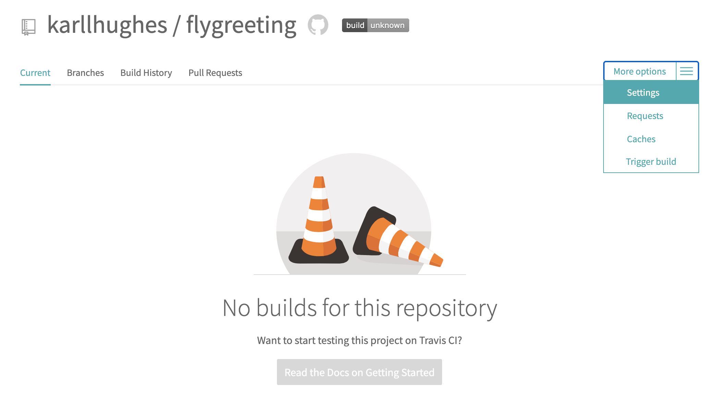
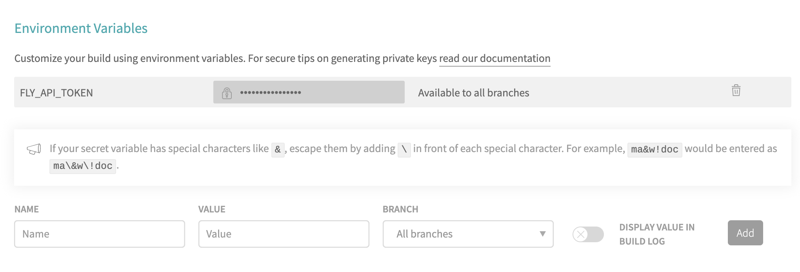
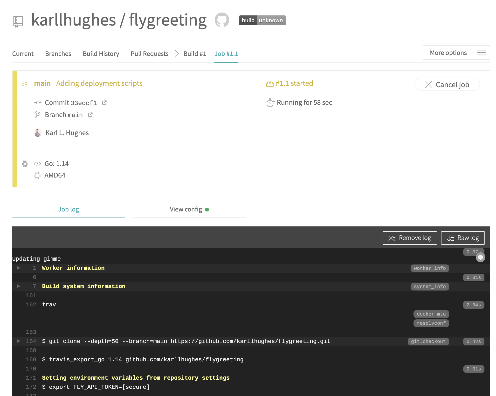

# Continuous Deployment for Fly Applications with Travis CI

[Continuous deployment](https://www.scaledagileframework.com/continuous-deployment/), in software development, is an automated process that aims to reduce the time elapsed between code changes to an application, and deployment. To achieve continuous deployment, all of the steps that make it possible for an application to be deployed must be automated, from the moment code is updated in version control. 

The principal benefit of this process is that it creates a release process that is repeatable, reliable, and predictable. This reduces the software development cycle time and gets features and bug fixes to users faster.

[Travis CI](https://travis-ci.org/) is a continuous integration platform that automatically builds, tests, and deploys your application whenever changes are committed to the codebase. It is also used to manage automatic deployment and notifications. Open-source projects on Travis are free.

[Fly](https://fly.io/) is a Docker-based platform as a service (PaaS) that allows you to deploy globally-distributed applications on the edge. Being location-aware, Fly enables you to serve your application from the edge node closest to your users. Most applications that can be packaged as a Docker image can be deployed to Fly.

## How to Configure Travis CI to Deploy Your Application to Fly

In this tutorial, you’ll learn how to deploy an application to Fly.io using Travis CI. You’ll see how to connect your application’s repository, and walk through the steps to configure Travis CI to build and deploy your application to Fly.

### Prerequisites

- A [GitHub](https://github.com/) or [Bitbucket](https://bitbucket.org/) account.
- The [Flyctl command line tool](https://fly.io/docs/flyctl/installing/).
- (Optional) [Docker](https://www.docker.com/) for testing the demo application locally.

### Cloning the Sample Application

To demonstrate deploying an application to Travis, you can use the [Flygreeting sample app on GitHub](https://github.com/fly-examples/flygreeting).

Fork [flygreeting](https://github.com/fly-examples/flygreeting) to your own repository (if you use GitHub), then clone it to your local machine:

```
git clone git@github.com:fly-examples/flygreeting.git
cd flygreeting
```

If you use Bitbucket, you can `git push` the cloned repository to your Bitbucket account.

To test the Flygreeting app locally, you can run it using Docker:

```
docker build -t flygreeting .
docker run -p 8080:8080 -d flygreeting
```

To test the application, call the `/countries` endpoint using curl:

```bash
curl http://localhost:8080/v1/countries/
```

You should see a JSON response with all the available country abbreviations:

```json
{"countries":["AD","AE","AF","AG","AI","AL","AM","AO","AQ","AR","AS","AT","AU","AW","AX","AZ","BA","BB","BD","BE","BF","BG","BH","BI","BJ","BL","BM","BN","BO","BQ","BR","BS","BT","BV","BW","BY","BZ","CA","CC","CD","CF","CG","CH","CI","CK","CL","CM","CN","CO","CR","CU","CV","CW","CX","CY","CZ","DE","DJ","DK","DM","DO","DZ","EC","EE","EG","EH","ER","ES","ET","FI","FJ","FK","FM","FO","FR","GA","GB","GD","GE","GF","GG","GH","GI","GL","GM","GN","GP","GQ","GR","GS","GT","GU","GW","GY","HK","HM","HN","HR","HT","HU","ID","IE","IL","IM","IN","IO","IQ","IR","IS","IT","JE","JM","JO","JP","KE","KG","KH","KI","KM","KN","KP","KR","KW","KY","KZ","LA","LB","LC","LI","LK","LR","LS","LT","LU","LV","LY","MA","MC","MD","ME","MF","MG","MH","MK","ML","MM","MN","MO","MP","MQ","MR","MS","MT","MU","MV","MW","MX","MY","MZ","NA","NC","NE","NF","NG","NI","NL","NO","NP","NR","NU","NZ","OM","PA","PE","PF","PG","PH","PK","PL","PM","PN","PR","PS","PT","PW","PY","QA","RE","RO","RS","RU","RW","SA","SB","SC","SD","SE","SG","SH","SI","SJ","SK","SL","SM","SN","SO","SR","SS","ST","SV","SX","SY","SZ","TC","TD","TF","TG","TH","TJ","TK","TL","TM","TN","TO","TR","TT","TV","TW","TZ","UA","UG","UM","US","UY","UZ","VA","VC","VE","VG","VI","VN","VU","WF","WS","YE","YT","ZA","ZM","ZW"]}
```

### Creating the Fly Configuration file
You'll need to use `flyctl` to create a new application and configuration file. If you haven't already, install the appropriate version of `flyctl` for your operating system using the [instructions here](https://fly.io/docs/hands-on/installing/).

Next, [sign up](https://fly.io/docs/hands-on/sign-up/) or [sign in](https://fly.io/docs/hands-on/sign-in/) to your Fly account via the command line:

```bash
# Sign up
flyctl auth signup

# Or sign in
flyctl auth login
```

You will be directed to a web page that will allow you to log in using your GitHub account or email and password.

Every Fly application makes use of the `fly.toml` file to manage deployments. Because you cloned this demo app, it already has a `fly.toml` file. You can delete it and generate a new one automatically by running:

```
rm fly.toml && flyctl init
```

This command creates an interactive session that requests your app name, organization name, and builder. You can type in a unique app name or leave it blank if you want Fly to autogenerate a unique name to avoid namespace collisions. Fly will also reserve the app name on the platform, for when you deploy. Select `Dockerfile` as your builder.

By the end of the session, you should have a `fly.toml` file in your app directory that looks similar to the following:

```
app = "morning-frost-7191"


[[services]]
  internal_port = 8080
  protocol = "tcp"

  [services.concurrency]
    hard_limit = 25
    soft_limit = 20

  [[services.ports]]
    handlers = ["http"]
    port = "80"

  [[services.ports]]
    handlers = ["tls", "http"]
    port = "443"

  [[services.tcp_checks]]
    interval = 10000
    timeout = 2000
```

### Configuring Travis CI for deployment
Travis CI uses a [`.travis.yml` file](https://docs.travis-ci.com/user/customizing-the-build) to configure the build, test, and deployment commands used during continuous integration. For this tutorial, you will add testing and deployment instructions to the `.travis.yml` file.

In your Flygreeting application, create a new file called `.travis.yml` and add the following:

```
language: go
go:
    - 1.14

script:
    - go test -v

deploy: 
    provider: script
    script: bash scripts/deploy.sh
    on:
        branch: main
```

This tells Travis CI that our application uses [Go 1.14](https://golang.org/). Travis will use its [Go environment](https://docs.travis-ci.com/user/languages/go/) to run the script. This runs Golang tests with minimal logging. For this example we want to override that and use `go test -v` to get the verbose test results. We run that through the script directive. If any script fails to run without errors, the whole build fails.

### Writing the Deployment Script
Next, create a deploy script to install and run the Flyctl command-line tool on the Travis CI virtual environment after the build succeeds. Create a new directory called `scripts` with a file called `deploy.sh` inside:

```
mkdir scripts && touch scripts/deploy.sh
```

Open the newly created `deploy.sh` in an editor and add the following:

```
#!/bin/sh -l

# install flyctl
curl -L https://fly.io/install.sh | sh

# set flyctl environmental variables
export FLYCTL_INSTALL="/home/travis/.fly"

export PATH="$FLYCTL_INSTALL/bin:$PATH"

echo "Successfully Installed Flyctl"

# deploy app
sh -c "flyctl deploy"

# get app Information
sh -c "flyctl info"

exit 0
```

This installs the Flyctl command-line tool, sets environmental variables, and adds `flyctl` to the command-line's path. Next, it runs `flyctl deploy` to deploy the `flygreeting` application using the `fly.toml` file. Once the application is deployed, it runs `flyctl info` to give you information about the newly deployed app, including the name, version, status, and hostname.

### Connect Travis CI to Your Git Repository
Next, you need to link Travis with your repository hosting service. Visit [travis-ci.com](https://travis-ci.com/) and sign in with either GitHub or Bitbucket. You will be redirected to your repository host, where you can authorize Travis CI to have access to your GitHub or Bitbucket account.

You will then be redirected back to Travis CI, where you will be able to select which repositories Travis CI has access to. Select the Flygreeting repository and continue with this tutorial.

### Give Travis CI Access to Fly
In order for Travis CI to automate deployment to Fly, you need to authorize it. You can do this by generating a Fly API token and adding it to Travis as an environment variable.

Use Flyctl to generate an API token:

```
flyctl auth token
```

Copy the generated API code and head back to the Travis CI Dashboard. In the upper right corner, click your profile avatar and select [Settings](https://travis-ci.com/account/repositories). On the Repositories tab, you should see the `flygreeting` repository listed. Click the settings button in front of it.



Navigate to the Environment Variables section and create a variable by setting `FLY_API_TOKEN` as the name, and the copied API key, as the value. Click the “Add” button to save this to your Travis account.



### Testing the Deployment
Now that your application is configured, your deployment script is written, and Travis is authorized to read your code repository, you’re ready to test the deployment process.

Commit and push your changes to the `main` branch of your GitHub or Bitbucket `flygreeting` repository. You can monitor the build and deployment progress by going to the [Travis CI Dashboard](https://travis-ci.com/dashboard) and selecting the Flygreeting repository from the Active Repositories tab. This will take you to the deployment log, which details every step of the deployment.



Once the Travis CI build has completed successfully, open the `flygreeting` app in the browser by running `flyctl open /v1/countries` on your local machine or call the endpoint with curl:

```bash
curl https://<your-fly-app-name>.fly.dev/v1/countries/
```

You should see a JSON response with the same country abbreviations seen above.

## Conclusion
In this tutorial, you’ve learned how to test and deploy a simple Go application to Fly using Travis CI. You’ve seen how to use the Flyctl command-line tool, connect a repository hosting platform to Travis, configure Travis for Fly, and finally check your running application on Fly. Updates to your application will be automatically deployed by pushing your code to GitHub/Bitbucket.

Further documentation for concepts and commands discussed in this guide are available here:
- [Flyctl CLI Reference](https://fly.io/docs/flyctl/)
- [Travis Script Deployment](https://docs.travis-ci.com/user/deployment/script/)

